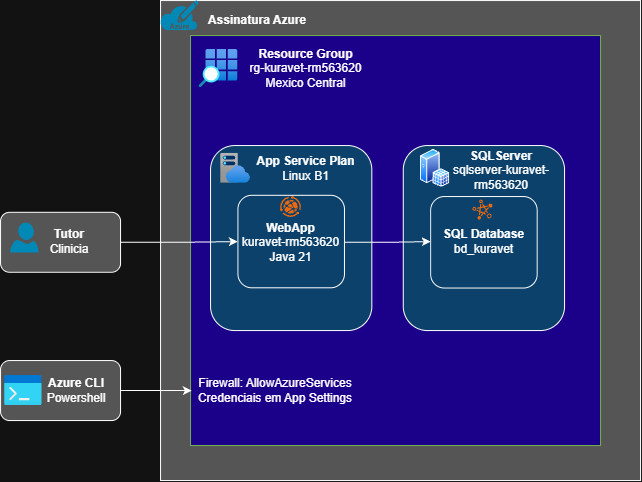

# KuraVet — Sprint 3 · DevOps Tools & Cloud Computing

Solução 100% PaaS na Azure: aplicação Spring Boot publicada em **Azure App Service (Linux)** conectada a um **Banco de Dados SQL do Azure**. Toda a infraestrutura é provisionada por Azure CLI. Nenhum recurso é containerizado e nenhum recurso é criado pelo portal.

**Vídeo demonstrativo:** https://youtu.be/ApngMisZKyU

**Repositório:** `https://github.com/KuraVet-Challenge-2026/java-devops.git`

---

## 1. Descrição da solução

O KuraVet é uma plataforma de gestão da jornada contínua de saúde do pet. Esta entrega expõe a aplicação web e a API REST que sustentam o núcleo do produto: o cadastro longitudinal do animal e o ciclo completo de teleconsulta.

A aplicação gerencia duas entidades relacionadas do core de saúde veterinária:

- **Pet** — perfil do animal (nome, espécie, raça, data de nascimento, sexo) e seu vínculo com o tutor responsável.
- **Consulta** — cada teleconsulta solicitada, com veterinário, data, tipo, status, diagnóstico e motivo de recusa.

O relacionamento é 1:N — um pet possui muitas consultas, e toda consulta pertence obrigatoriamente a um pet. Sobre essas duas tabelas a solução implementa CRUD completo, acessível tanto pelo portal web (Thymeleaf) quanto pela API REST.

A consulta percorre uma máquina de estados real: o tutor solicita pelo aplicativo, o pedido chega como `SOLICITADA`, o veterinário aprova (`AGENDADA`) ou recusa (`RECUSADA`, com motivo obrigatório), e após o atendimento é encerrada como `REALIZADA` com diagnóstico.

## 2. Benefícios para o negócio

O mercado veterinário brasileiro opera de forma episódica: o tutor procura a clínica em emergências ou quando a vacina obrigatória vence. O vínculo é fraco, o histórico é fragmentado e o Lifetime Value por animal fica abaixo do potencial.

A solução ataca o problema em quatro frentes:

- **Histórico longitudinal estruturado.** Atendimentos deixam de existir soltos em prontuários de papel e passam a formar uma linha do tempo consultável, disponível ao tutor no aplicativo e ao veterinário no painel.
- **Triagem organizada.** O campo de status ordena a fila de teleconsulta e dá visibilidade de quantos pedidos aguardam decisão, reduzindo o tempo ocioso do profissional.
- **Integridade garantida no banco.** Constraints asseguram que o motivo de recusa só existe quando a consulta é recusada, e que o diagnóstico só existe quando ela foi realizada. A regra não depende da aplicação.
- **Custo operacional previsível.** A escolha por PaaS elimina gestão de servidores, patching de sistema operacional e manutenção de imagens. A clínica parceira não precisa de equipe de infraestrutura, e a Azure entrega backup automático sem esforço adicional.

## 3. Arquitetura



O tutor acessa a aplicação por HTTPS na porta 443. O App Service executa o jar Spring Boot sobre o runtime Java 21 gerenciado pela plataforma sem imagem de container em nenhum ponto do fluxo. A aplicação lê a connection string das variáveis de ambiente e abre conexão TLS na porta 1433 com o Banco de Dados SQL, que vive no mesmo Grupo de Recursos e na mesma região.

| Camada | Recurso | Nome | Configuração |
|---|---|---|---|
| Agrupamento | Grupo de Recursos | `rg-kuravet-rm562396` | Mexico Central |
| Computação | Plano do Serviço de Aplicativo | `plan-kuravet-rm562396` | Linux, B1 |
| Aplicação | Serviço de Aplicativo | `kuravet-rm562396` | Java 21, HTTPS |
| Dados | Servidor SQL | `sqlserver-kuravet-rm562396` | Login e firewall |
| Dados | Banco de Dados SQL | `bd_kuravet` | Básico (DTU) |

## 4. Tecnologias

Java 21 · Spring Boot · Spring Security · Spring Data JPA · Flyway · Thymeleaf · Maven · Azure App Service · Azure SQL Database · Azure CLI · PowerShell

## 5. Pré-requisitos

| Ferramenta | Versão mínima | Verificação |
|---|---|---|
| Azure CLI | 2.60 | `az version` |
| Java (JDK) | 21 | `java -version` |
| Git | 2.40 | `git --version` |

## 6. Passo a passo de deploy

Todos os comandos são executados no terminal. Nenhuma etapa usa o portal da Azure.

### 6.1 Clonar o repositório

```powershell
git clone https://github.com/KuraVet-Challenge-2026/java-devops.git
cd java-devops
```

### 6.2 Autenticar na Azure

```powershell
az login
az account show --output table
```

### 6.3 Carregar as variáveis

O ponto seguido de espaço é obrigatório: ele carrega as variáveis na sessão atual do PowerShell.

```powershell
. .\infra\00-Variaveis.ps1
```

A senha do administrador do banco é digitada neste momento, de forma mascarada, e não fica gravada em nenhum arquivo do repositório.

### 6.4 Provisionar a infraestrutura

Execute na ordem:

```powershell
.\infra\01-Variaveis.ps1        # Variaveis de ambiente
.\infra\01-ResourceGroup.ps1    # Grupo de Recursos
.\infra\02-AppServicePlan.ps1   # Plano do Serviço de Aplicativo (Linux B1)
.\infra\03-WebApp.ps1           # Web App com runtime Java 21
.\infra\04-Database.ps1         # Servidor SQL, banco e regras de firewall
.\infra\05-AppSettings.ps1      # Connection string como variável de ambiente
.\infra\06-Deploy.ps1           # Build Maven e publicação do jar
```

### 6.5 Validar

```powershell
$url = "https://kuravet-rm562396.azurewebsites.net"
curl.exe -i "$url/actuator/health"
curl.exe -u tutor:tutor123 "$url/api/pets"
```

O portal web fica disponível em `$url`, com login `veterinario` / `vet123`.

### 6.6 Encerrar (somente após a correção)

```powershell
az group delete -n rg-kuravet-rm562396 --yes
```

## 7. Usuários de demonstração

| Usuário | Senha | Perfil | Acesso |
|---|---|---|---|
| `tutor` | `tutor123` | TUTOR | API REST de pets e consultas |
| `veterinario` | `vet123` | VETERINARIO | Portal web em `/portal/painel` |

## 8. Endpoints da API

### Pet

| Método | Rota | Descrição |
|---|---|---|
| `POST` | `/api/pets` | Cadastra um novo pet |
| `GET` | `/api/pets` | Lista os pets do tutor |
| `GET` | `/api/pets/{id}` | Consulta um pet específico |
| `PUT` | `/api/pets/{id}` | Atualiza os dados do pet |
| `DELETE` | `/api/pets/{id}` | Remove o pet |

### Consulta

| Método | Rota | Descrição |
|---|---|---|
| `POST` | `/api/consultas/solicitacoes` | Solicita uma teleconsulta |
| `GET` | `/api/consultas` | Lista as consultas |
| `PUT` | `/api/consultas/{id}` | Atualiza a consulta |
| `DELETE` | `/api/consultas/{id}` | Remove a consulta |

### Exemplos de uso

```powershell
$url = "https://kuravet-rm562396.azurewebsites.net"

# CREATE - pet
'{"nome":"Amora","especie":"Gato","raca":"Persa","dataNascimento":"2022-04-18","sexo":"F"}' | Out-File -Encoding ascii pet.json
curl.exe -u tutor:tutor123 -X POST "$url/api/pets" -H "Content-Type: application/json" -d "@pet.json"

# CREATE - consulta relacionada ao pet
'{"idPet":1,"idVeterinario":1,"dataConsulta":"2026-10-15","tipoConsulta":"Teleconsulta - Dermatologia"}' | Out-File -Encoding ascii consulta.json
curl.exe -u tutor:tutor123 -X POST "$url/api/consultas/solicitacoes" -H "Content-Type: application/json" -d "@consulta.json"

# READ
curl.exe -u tutor:tutor123 "$url/api/pets"

# DELETE
curl.exe -u tutor:tutor123 -i -X DELETE "$url/api/pets/11"
```

## 9. Banco de dados

O DDL completo, com comentários em todas as tabelas e colunas, chaves primárias e estrangeiras, constraints de validação e carga inicial está em [`script_bd.sql`](script_bd.sql).

O mesmo conteúdo é aplicado automaticamente pelo **Flyway** no start da aplicação, a partir de `src/main/resources/db/migration/sqlserver`.

Conexão para verificação manual:

```
Servidor:  sqlserver-kuravet-rm562396.database.windows.net
Porta:     1433
Banco:     bd_kuravet
Usuário:   kuravetadmin
Encrypt:   Mandatory
```

Consulta para conferir os comentários gravados no DDL:

```sql
SELECT t.name AS TABELA, c.name AS COLUNA, ep.value AS COMENTARIO
FROM sys.extended_properties ep
JOIN sys.tables t ON t.object_id = ep.major_id
LEFT JOIN sys.columns c ON c.object_id = ep.major_id AND c.column_id = ep.minor_id
WHERE ep.name = 'MS_Description'
ORDER BY t.name, c.column_id;
```

## 10. Segurança

- Nenhuma credencial existe no código-fonte. A connection string, o usuário e a senha são injetados exclusivamente por `az webapp config appsettings set` e lidos pelo Spring como variáveis de ambiente.
- O `application-azure.properties` versionado contém apenas placeholders resolvidos em runtime.
- A conexão com o banco exige `encrypt=true`.
- O firewall do servidor SQL libera apenas os serviços do Azure e o IP do operador.
- Autenticação e autorização por perfil via Spring Security: o tutor não acessa o painel da clínica, e o veterinário não cria pets.
- O `.gitignore` bloqueia `.env`, chaves, `target/` e arquivos de configuração local.

## 11. Estrutura do repositório

```
.
├── README.md
├── script_bd.sql
├── docs/
│   └── arquitetura.png
├── infra/
│   ├── 00-Variaveis.ps1
│   ├── 01-ResourceGroup.ps1
│   ├── 02-AppServicePlan.ps1
│   ├── 03-WebApp.ps1
│   ├── 04-Database.ps1
│   ├── 05-AppSettings.ps1
│   └── 06-Deploy.ps1
└── src/                     (aplicação Spring Boot)
```

## 12. Integrantes

| Nome completo | RM |
|---|---|
| GUILHERME MACEDO | RM562396 |
| PEDRO HENRIQUE | RM563405 |
| HENRIQUE MARTINS | RM563620 |

---

> Esta entrega usa exclusivamente a **Opção 2 — Serviço de Aplicativo + Banco PaaS**. Não há Dockerfile, docker-compose, ACR ou ACI neste repositório.
